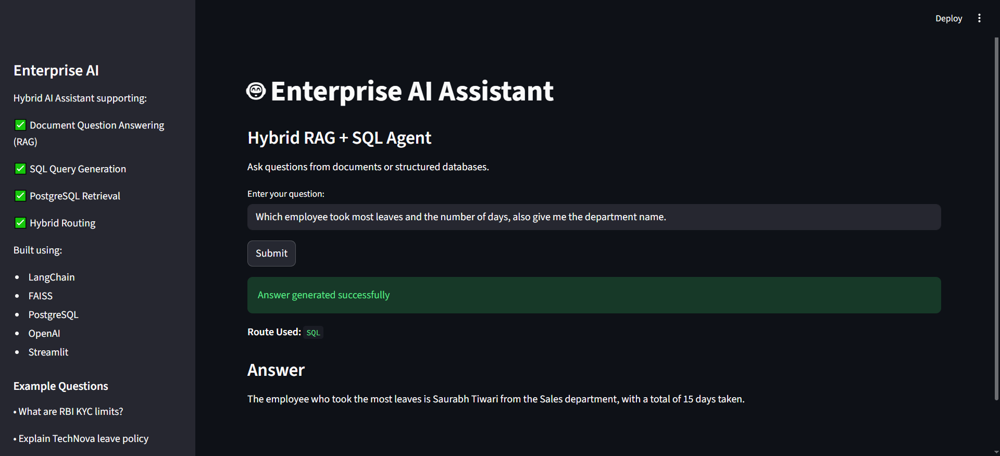

# Enterprise AI Assistant 🤖

Hybrid AI Assistant built using **RAG + SQL Query Generation + PostgreSQL + FAISS + Streamlit**

This project combines **unstructured retrieval (documents)** and **structured retrieval (SQL databases)** into a single AI assistant capable of answering enterprise questions using:

- PDFs
- Markdown documents
- PostgreSQL databases
- Vector search (FAISS)
- Natural language SQL generation
- Hybrid routing (SQL vs RAG)

---

# Features 🚀

### Document Intelligence (RAG)

✅ PDF ingestion pipeline

✅ Markdown ingestion pipeline

✅ Metadata enrichment

✅ Text preprocessing

- Whitespace normalization
- Hyphenation fixing
- Footer removal
- Newline cleanup
- Numeric-word merge fixes

✅ Recursive chunking

✅ Chunk validation

✅ Vector embeddings

✅ FAISS vector store persistence

✅ Semantic retrieval

---

### Structured Database Querying (SQL)

✅ PostgreSQL integration

✅ Schema-aware SQL generation

✅ SQL execution

✅ SQL → Natural language response conversion

✅ Multi-table joins

---

### Hybrid Routing

Questions are automatically routed to:

```text
SQL → Structured database queries
Vector → Document retrieval questions
```

Examples:

```text
Who has highest salary?
→ SQL

Explain TechNova leave policy
→ Vector

Average salary by department
→ SQL

What are RBI KYC limits?
→ Vector
```

---

### UI

✅ Streamlit UI

Supports:

- Question input
- Response generation
- SQL / Vector route display
- End-to-end AI interaction

---

# Architecture 🏗️

```text
User
 ↓
Streamlit UI
 ↓
Query Router
 ↓
 ┌──────────────┬───────────────┐
 │              │               │
SQL Route    Vector Route
 │              │
 ↓              ↓
LLM         Retriever
 │              │
 ↓              ↓
PostgreSQL    FAISS
 │              │
 └──────Context─┘
        ↓
LLM Response Generation
        ↓
Answer
```

---

# Project Structure 📂

```text
enterprise-ai-rag/

app/
│
├── config/
│
├── database/
│      postgres_connection.py
│      schema.py
│
├── generation/
│      response_generator.py
│      sql_generator.py
│      sql_response_generator.py
│
├── ingestion/
│      chunking/
│      loaders/
│      metadata/
│      pipelines/
│      preprocessing/
│      validators/
│      ingestion_orchestrator.py
│
├── llm/
│      llm_initializer.py
│
├── retrieval/
│      embeddings.py
│      retrieval.py
│      sql_retrieval.py
│      vectorstore.py
│
├── routing/
│      query_router.py
│      query_orchestrator.py
│
├── ui/
│      streamlit_app.py
│
└── tests/scripts/
│
data/
│
README.md
requirements.txt
.gitignore
```

---

# Tech Stack ⚙️

### LLM

- OpenAI GPT

### Vector Database

- FAISS

### Embeddings

- HuggingFace Embeddings

### Backend

- Python

### Database

- PostgreSQL

### Frameworks

- LangChain
- Streamlit

---

# Example Queries 💬

### SQL

```text
Who has highest salary?

Which employee took most leaves?

Average salary by department?

Department with highest average salary?
```

---

### RAG

```text
Explain TechNova leave policy

What are RBI KYC limits?

What is maternity leave policy?

Explain employee benefits
```

---

# Installation 🔧

Clone repository:

```bash
git clone <repo_url>

cd enterprise-ai-rag
```

Create virtual environment:

```bash
python -m venv .venv
```

Activate:

Windows:

```bash
.venv\Scripts\activate
```

Install dependencies:

```bash
pip install -r requirements.txt
```

---

# Environment Variables 🔐

Create:

```text
.env
```

Add:

```env
OPENAI_API_KEY=your_key

POSTGRES_USER=your_user
POSTGRES_PASSWORD=your_password
POSTGRES_DB=enterprise_ai_rag
POSTGRES_HOST=localhost
POSTGRES_PORT=5432
```

---

# Running the Application ▶️

Run Streamlit:

```bash
streamlit run app/ui/streamlit_app.py
```

Open:

```text
http://localhost:8501
```

---

# Current Capabilities ✅

Supports:

- Hybrid routing
- SQL generation
- RAG retrieval
- PostgreSQL
- Streamlit UI
- Vector persistence
- Hallucination reduction
- Multi-table SQL queries
- Document intelligence

---

# Future Improvements 📌

Planned:

- Better query routing
- Evaluation framework
- Citation generation
- Chat history memory
- Authentication
- Docker support
- Deployment
- Agentic workflows
- Multi-modal ingestion
- Observability & tracing

---

# Screenshots 📷

(Add screenshots here)

Example:

```md

```

---

# Author

Built by **Pranjal Saxena**

Backend + AI Engineering learning project focused on building production-style AI systems.
